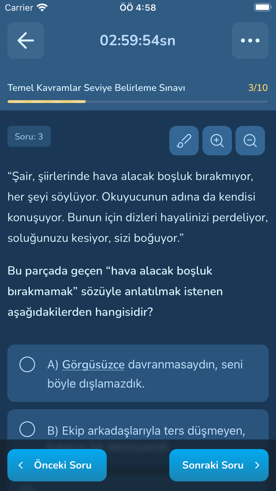
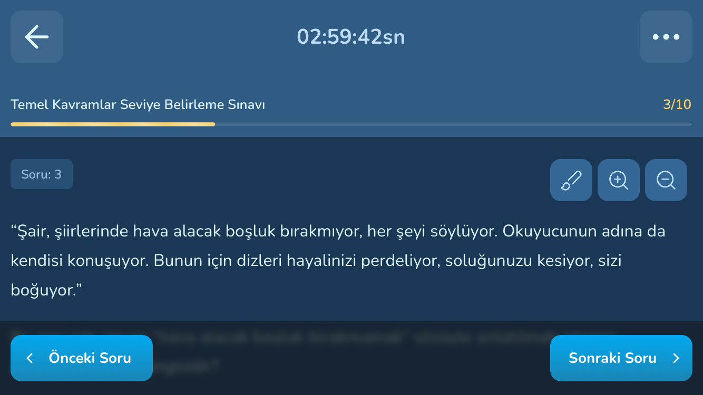
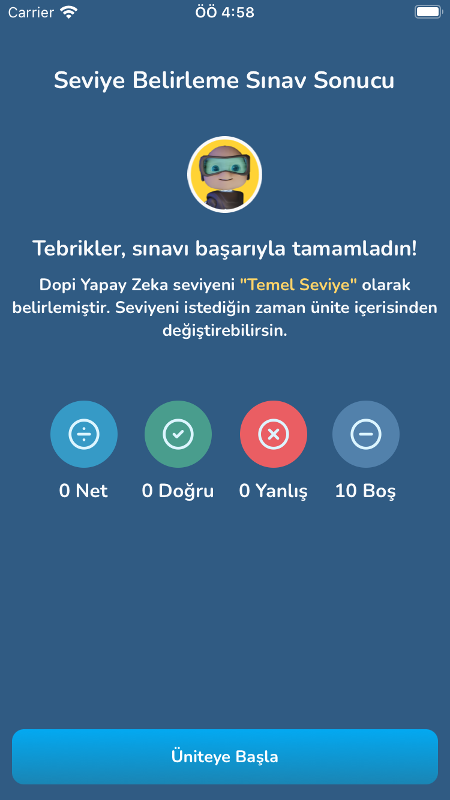

# Quiz App Case Study

This project is a case study for Doping Quiz Application built with React Native and Typescript. The Quiz app consists of two main pages - Questions Page and Results Page. In the Questions Page, users can answer the questions presented to them, and in the Results Page, they get to see the results of the quiz they took.


## Installation

Before you can run this project, you will need to have Node, npm, and React Native CLI installed on your local machine. If you don't have these installed, please check out the following guides:

- [Node & npm](https://nodejs.org/en/download/)
- [React Native CLI](https://reactnative.dev/docs/environment-setup)

Once you have these prerequisites, follow these steps to install and run the project:

1. **Clone the repository** to your local machine using Git:

   ```
   git clone https://github.com/muratclk/dopingTechCaseStudy
   ```

2. **Navigate into the directory** of the project:

   ```
   cd quiz-app
   ```

3. **Install dependencies** using npm:

   ```
   npm install
   ```

4. **Install pods** for iOS :

   ```
   cd ios
   pod install
   ```

5. **To run the app**, execute the following command:

   For iOS:

   ```
   npx react-native run-ios
   ```

   For Android:

   ```
   npx react-native run-android
   ```

## App Usage

### Questions Page

Users can select the correct option for each question and navigate forward to answer subsequent questions.




### Results Page

After all questions have been answered, users are navigated to the Results Page where they can see their score.


